# Stash

> **Your Spotify + YouTube Music library**

[](LICENSE)
[](#requirements)
[](https://github.com/rawnaldclark/Stash/releases)
[](https://discord.gg/vcbjEby5PC)

Stash mirrors your Spotify and YouTube Music libraries to your Android phone. You connect each service, pick the playlists and mixes you want, and Stash either downloads them for offline playback — as real FLAC files when a lossless source has them — or surfaces them as a streaming index so you can stream tracks without filling up your storage.

There's no Stash account and no analytics. Your credentials live on your phone — the Spotify, YouTube, and Discord tokens encrypted, the rest in app-private storage — and each one is only ever sent back to the service it came from. Spotify and YouTube aren't the only hosts Stash talks to, though — lyrics, scrobbling, artist metadata, Discord presence, and lossless all have their own. [The full list is below](#what-stash-talks-to).

<p align="center">
  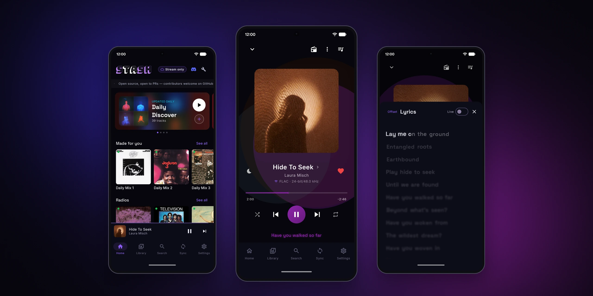
</p>


## Screenshots

Stash has dark, light and pure-black themes.

### Dark

<table>
  <tr><td>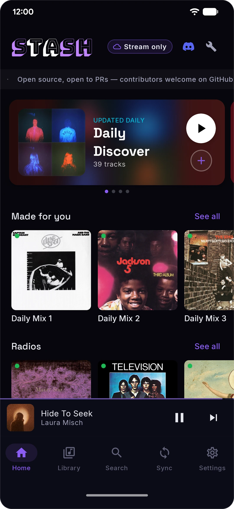</td><td>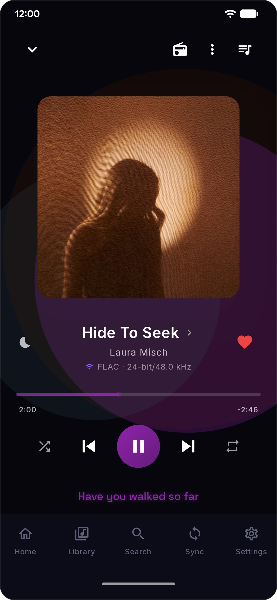</td><td>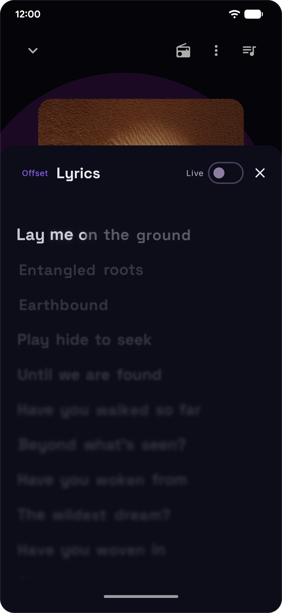</td><td>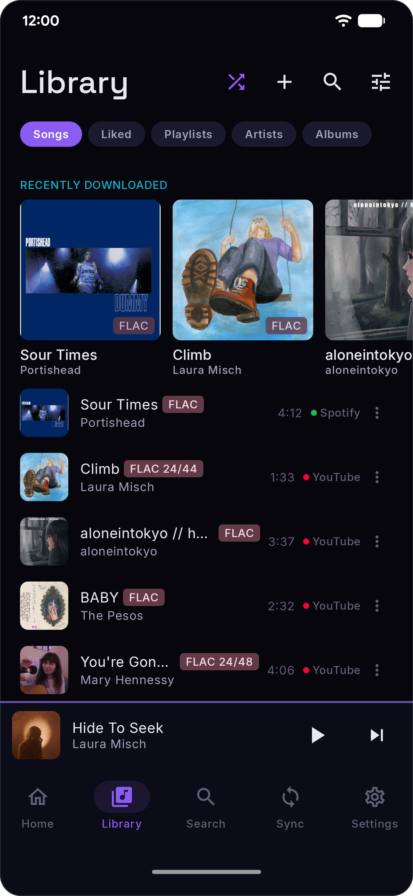</td></tr>
  <tr><td>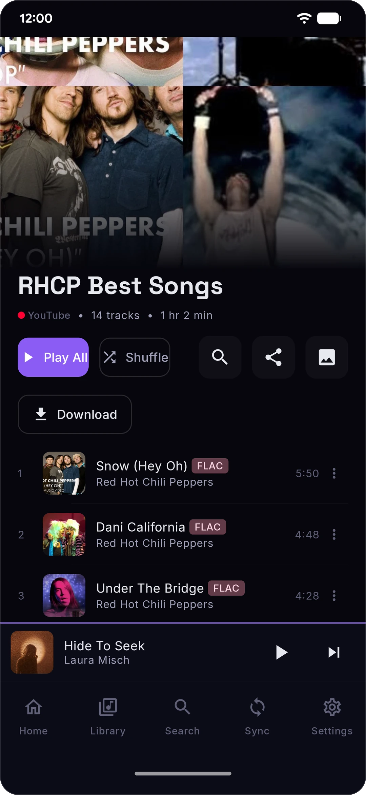</td><td>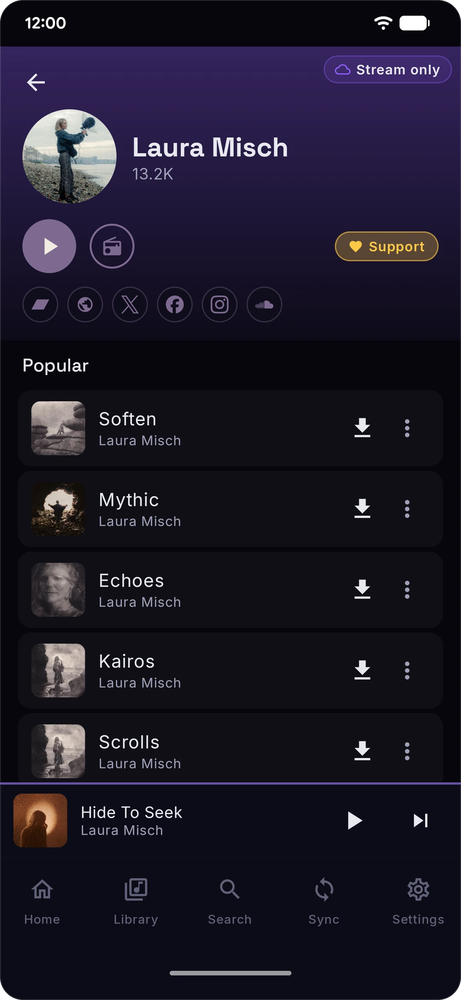</td><td>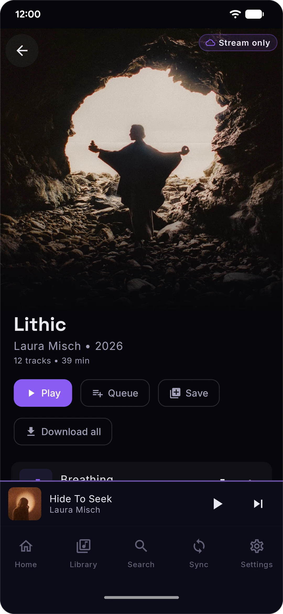</td><td>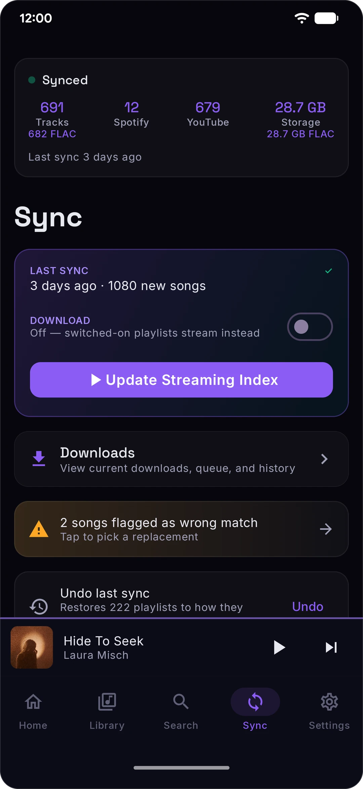</td></tr>
</table>

### Light

<table>
  <tr><td>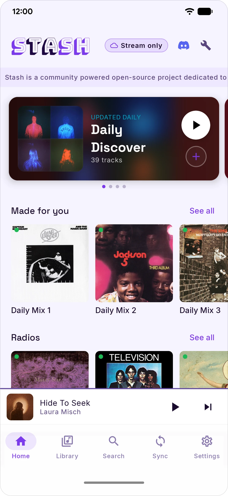</td><td>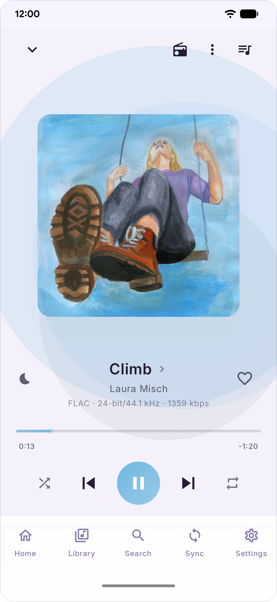</td><td>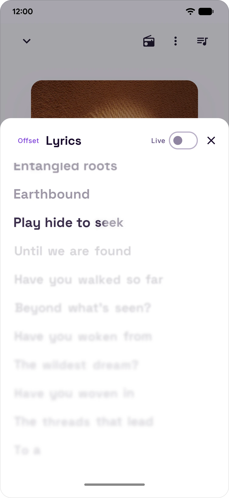</td><td>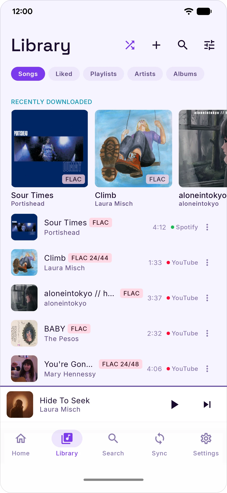</td></tr>
  <tr><td>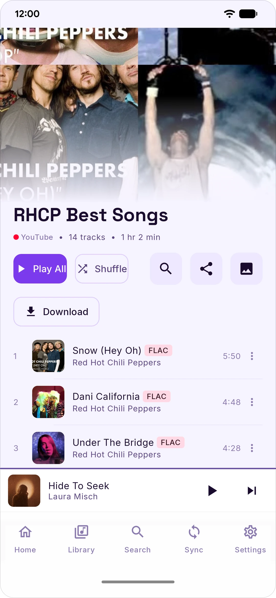</td><td>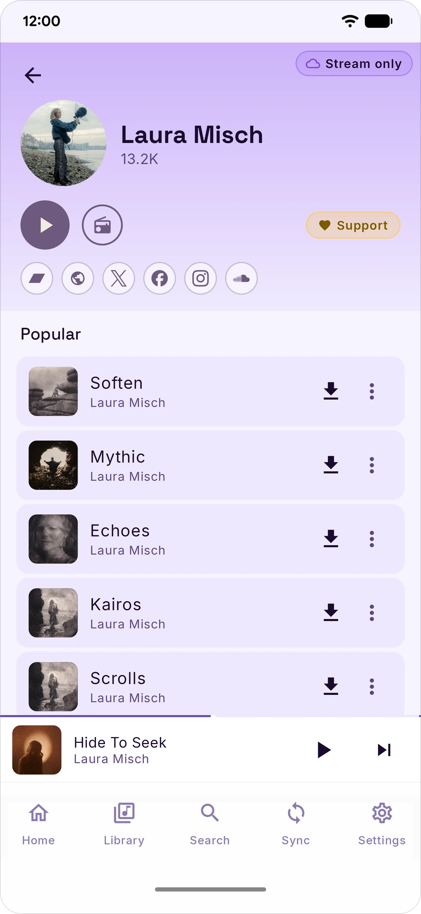</td><td>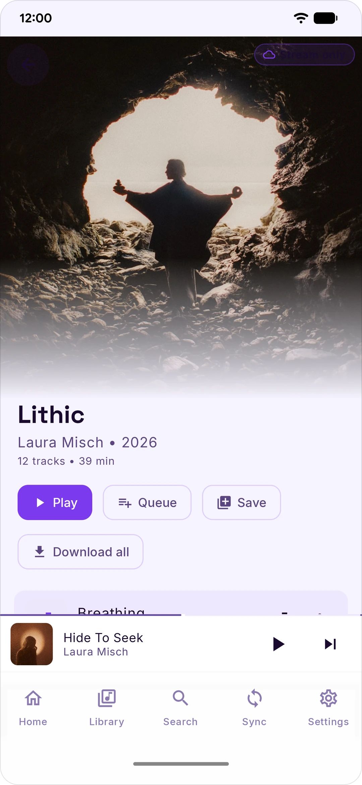</td><td>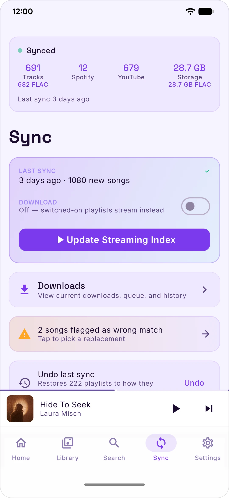</td></tr>
</table>

---

## Download or stream

One switch, **Download**, decides what a sync does. It's on the Sync tab, and in Settings › Playback as **Stream only** / **Download**. Songs on your phone play from your phone, and the rest stream.

**Download** — sync saves your switched-on playlists and mixes to your phone, so they play with no connection. It costs storage. Whether a download lands as FLAC depends on whether a lossless source has the song — see [Lossless](#lossless). Without one, a download waits for FLAC ("Waiting for lossless") unless you turn on **Lossy fallback** in Settings › Audio & Quality, which takes an AAC or Opus copy instead.

**Stream only** — sync keeps your playlists up to date without saving them, so it takes almost no storage. Songs stream over Wi-Fi, or over mobile data once you turn on **Stream on cellular** in Settings › Playback.

Either way, a playlist's own Download button keeps that playlist on your phone.

---

## Lossless

There's no Qobuz account or token inside the app. (The official build does carry Last.fm API keys.) FLAC comes from the first of these that can serve the song:

- **Your own Qobuz account** — connect it in Settings › Audio & Quality. Connecting asks for your Qobuz email and password, which are sent once to Qobuz to mint a token; Stash stores the token, not the password. It then streams and downloads from your own subscription, the same catalog your Qobuz app sees.
- **Your own relay endpoint** — if you run a Qobuz relay, paste its URL into the custom-endpoint field (under Advanced on the same screen) and Stash routes through it.
- **Stash's relay** — the official release build fetches a signed config at each cold start that lists `stash-relay.rawnaldclark.workers.dev`, a relay the project runs. With nothing of your own connected, Stash uses it for FLAC. Connect your own account and your phone uses your account first, falling back to the relay only for a song whose request on your account fails, or while Qobuz is rejecting your login. It hands your phone a short-lived Qobuz CDN link for the track; the audio comes from Qobuz's CDN, never through the relay. [What Stash talks to](#what-stash-talks-to) says what it's sent. The relay hostname is not in the APK — a plain source checkout has no config URL, so a Stash you build yourself has this path switched off entirely.

When no lossless source can serve a song, it streams in AAC or Opus instead, and Now Playing shows where it came from. Downloads wait for FLAC by default and show as "Waiting for lossless"; to take an AAC or Opus copy instead, turn on **Lossy fallback** in Settings › Audio & Quality.

---

## Features

### Library

- **Spotify + YouTube Music in one unified library** — liked songs, playlists, daily mixes, every Spotify mix worth syncing
- **Bulletproof matching** — finds the right version of a track 99% of the time
- **Last.fm scrobbling**, optional, off by default
- **Last.fm recommendations** — connect Last.fm and it appears under Sync → Sources, keeping a rotating "Recommended by Last.fm" playlist of tracks it suggests from your listening
- **Wrong-match flag** — if Stash picked the wrong version, flag it from Now Playing, then pick the right one from the Sync tab
- **Likes and history mirroring** — new likes in Stash can be mirrored to Spotify, YouTube Music and Last.fm, and songs you finish can be added to your YouTube Music history. Each is off until you turn it on.

### Playback

- 5-band equalizer with presets, bass boost
- Crossfader
- Normalizer
- Synced lyrics, pulled from LRCLIB and scrolled with the track

### Discord

- **Rich Presence** — show what you're listening to as your Discord status, art and all. Optional, off by default, and disconnecting clears it immediately.

### Privacy

- No Stash account server, no login, no analytics, no third-party crash reporters. A handful of hosts the project runs are fetched from; none of them ever sees a credential.
- Cookies stored on-device, encrypted with AES-256-GCM via Google's [Tink](https://developers.google.com/tink). When yt-dlp runs, it gets a temporary copy of your YouTube cookie in a private file only Stash can read, deleted as soon as it's done
- Your Spotify, YouTube, and Discord credentials are sent to Spotify, YouTube, and Discord respectively and nowhere else — no host in the list below ever sees them
- GPL-3.0-or-later, every line of code is open source

---

## What Stash talks to

Stash has no account server, but it isn't a two-service app either. Everything the official release APK can reach, and what for. A build you make yourself from a plain checkout reaches strictly less: it has no Last.fm keys or proxy and no relay config.

- **Spotify** (`accounts.`, `open.`, `api-partner.`, `api.spotify.com`, `www.spotify.com`, `clienttoken.spotify.com`) — sign-in and library sync. Two optional features, both off by default, also write to your account: mirroring your likes, and auto-saving songs you play often to your Liked Songs.
- **YouTube + YouTube Music** (`music.youtube.com`, `www.youtube.com`, and Google's OAuth endpoints if you use the Google sign-in) — library sync, search, artist and album pages, artist photos, and the audio itself via yt-dlp. Two optional features, both off by default, also write to your account: mirroring your likes, and sending your plays to your YouTube Music history. Each play is reported to the tracking address that comes back in YouTube's player response.
- **`m.youtube.com`** — the YouTube sign-in window
- **`*.googlevideo.com`** — YouTube's audio CDN; the URL comes back in the player response, so no hostname for it ships in the app
- **Google OAuth** (`oauth2.googleapis.com`) — only if you use the YouTube device-code sign-in
- **What the sign-in windows load** — the Spotify, YouTube and Discord sign-in windows show those services' own web pages, and the pages load what they need from other hosts, such as Spotify's `accounts.scdn.co`, Google reCAPTCHA (`www.google.com`, `www.gstatic.com`), Google's sign-in pages, and Discord's image CDN and CAPTCHA. Stash itself never calls those hosts; the pages do.
- **GitHub** (`api.github.com`) — the update checks, for Stash itself and for yt-dlp's nightly builds, at every cold start and daily
- **GitHub release downloads** (`github.com`, `release-assets.githubusercontent.com`) — a newer yt-dlp nightly build when there is one, and a helper script yt-dlp needs for YouTube playback, whether or not you use streaming
- **Qobuz** — catalog requests go straight from your phone to `www.qobuz.com`, with no account, under Qobuz's public web-player app id. Stash also contacts Qobuz's web player, `open.qobuz.com`, when that id needs refreshing and when you connect an account; that host is sent nothing about you.
  - **On Home** — the New Releases, Top Albums and Qobuz Playlists rows. No account needed and **on by default**; turning off "Qobuz discovery on Home" in Settings › Library & Storage, or hiding those rows in Home layout, stops these requests.
  - **On artist pages** — Qobuz is sent the artist's name, to fill in albums YouTube is missing, and an album's id when you open one of those albums. This runs whatever the Home setting is, and no setting turns it off.
  - **Lossless lookups** — while Lossless is on, which is the default, every song about to stream (including the next one up) or about to download is looked up here first, by its ISRC or by artist and title. This happens with or without an account, and even when the song then plays from somewhere else, so Qobuz learns what you play. Turning Lossless off in Settings › Audio & Quality stops these lookups, except when you ask for FLAC yourself with "Find in FLAC" in Now Playing or "Upgrade to FLAC" in Library.
  - **Your own account** — only if you connect one in Settings › Audio & Quality. Connecting sends your Qobuz email and password to Qobuz once, to get a token; Stash keeps the token and your email, not the password. Each FLAC link is then requested with that token. While Lossless is on and your account is working, songs you scroll past in search results and on artist and album pages are also looked up ahead of time, so they start faster.
- **`stash-relay.rawnaldclark.workers.dev`** — the project's lossless relay, used only by the official release build. With no Qobuz account or relay endpoint of your own, Stash asks it for every FLAC link. With your own account connected, Stash asks your account first. It uses the relay for a song when the request on your account fails, and for every song while Qobuz is rejecting your login. Your login is retried once a minute, so a login Qobuz no longer accepts keeps using the relay until you sign in again or disconnect it. With your own relay endpoint set, the project's relay is used when yours fails.
  - **What it is sent and keeps** — the Qobuz track id and format of each song, whether it's a download (Stash marks sync, playlist and mix downloads, their retries and its FLAC upgrade passes; anything else counts as playing, including songs you download from Search or an artist or album page), and a random id for your install. Nothing else about you, and never a credential, so this host learns what an anonymous install listens to. Like any server, it sees your IP address, and it uses it for a per-address rate limit. When it has to ask Qobuz for a new link instead of reusing a recent one, it adds one to a daily count for your install id, stored with a scrambled form of your IP address (a salted hash). That enforces the daily limits and shows when one connection poses as many installs. These counts are kept for the current day and the 7 before it, then deleted, and stay restorable by the owner from Cloudflare's database backups for up to 30 days. The relay's log line for each of those requests shows the track, the format, the first 8 characters of your install id, whether it's a download, your country, and which Cloudflare location answered. The relay hands back a short-lived link, never the audio. If you set your own relay endpoint instead, it is sent the same, and what it keeps is up to whoever runs it.
- **Qobuz's audio CDN** (today `streaming-qobuz-std.akamaized.net`) — where the FLAC itself comes from, whether the link came from your account or the project's relay. The address comes back with each link, so it can change. It sees your IP address and which file you're getting. Share diagnostics, when you use it, also checks that this CDN, the relay and the relay config host answer.
- **`stash-tipjar.rawnaldclark.workers.dev/lossless.json`** — the signed relay config and its `.sig`, fetched at every cold start and every 6 hours after by the official release build. This URL *is* in the APK; it is fetched with nothing of yours connected, like the tip jar list on the same host. A plain checkout has no config URL and skips it.
- **JioSaavn** (`www.jiosaavn.com`, `aac.saavncdn.com`) — the AAC 320 fallback when nothing lossless matched
- **LRCLIB** (`lrclib.net`) — synced lyrics
- **iTunes Search** (`itunes.apple.com`) — the first step of word-synced Apple Music lyrics: sent the song's title and artist to find its Apple Music song id
- **paxsenix's lyrics API** (`lyrics.paxsenix.org`) — the second step: sent that Apple song id, and nothing else about you, to get the word-synced lyrics (its cache first, then a live lookup)
- **KuGou** (`mobileservice.kugou.com`, `lyrics.kugou.com`) — synced lyrics when the sources before it have none: sent the song's title and artist, and for some lookups its length. It sees an ordinary desktop-browser User-Agent, not Stash's.
- **YouTube Music lyrics** (`music.youtube.com`) — plain-text lyrics as the last fallback, only for songs that have a YouTube id
- **When each lyrics host is asked** — LRCLIB, iTunes Search and paxsenix see a `Stash/<version>` User-Agent. iTunes Search and paxsenix are asked whenever lyrics are looked up or fetched for a download while Apple Music is the preferred lyrics source, which is the default. They're also asked by a background pass that upgrades lyrics you already have (once after each app update, on Wi-Fi) and by "Fetch lyrics" in Library Health. LRCLIB, KuGou and YouTube Music come next, in that order, each only when the ones before it come back empty or fail: from Now Playing, after a download, and by "Fetch lyrics", never by the background pass. Setting the lyrics source to LRC only in Settings › Playback stops iTunes Search and paxsenix. LRCLIB, KuGou and YouTube Music keep working.
- **Last.fm** (`ws.audioscrobbler.com`, and `www.last.fm` for its sign-in page) — scrobbling, only if you connect your account, and loved tracks if you also turn on mirroring likes to Last.fm. Official release builds also look things up on Last.fm without needing an account: artist bios on artist pages, missing album art, genre tags for your downloads, and the similar artists, songs and genres behind radios and Stash Mixes (see below). Those lookups go through `stash-lastfm-proxy.rawnaldclark.workers.dev`, a caching Worker the project runs. It sees the artist or song being looked up, never your account, and keeps only Last.fm's answers, for up to 14 days. If the proxy fails, Stash asks Last.fm directly. With your account connected and Stash Mixes on, Stash also reads your top artists and songs, and looks up your downloaded songs under your username, straight from Last.fm.
- **ListenBrainz** (`api.listenbrainz.org`) — optional scrobbling, only if you connect it
- **Discord** (`discord.com`, `cdn.discordapp.com`) — optional Rich Presence, only if you connect your account. While a song plays, Stash sends Discord its title, artist, album, a link to its cover and how far into the song you are; pausing clears it. Stash sets this status through your account's own session, which it gets from the sign-in window. If Discord needs your permission first, Settings opens Discord's permission page in your browser. Agreeing sends your browser on to a blank page at `paraliyzed.net`, with a one-time code in the address that Stash doesn't use. See the callout in [First-time setup](#first-time-setup) for exactly how it works and what that means.
- **MusicBrainz** (`musicbrainz.org`) — artist metadata
- **`stash-tipjar.rawnaldclark.workers.dev`** — the public supporters list behind the Home supporter pill. Fetch only; it's told nothing about you.
- **The share Worker** (`stashfm.app`, and its first address, `stash-share.rawnaldclark.workers.dev`) — a Worker the project runs, behind four features. Depending on its version, Stash uses one address or the other; versions that use `stashfm.app` switch to the other address when `stashfm.app` can't be reached.
  - **Shared mixes** — only when you share, open or follow one. Sharing a mix sends its name, its songs (title, artist and, when known, album, length, ISRC and Spotify/YouTube IDs), up to four album-art links and, if you choose, a display name; editing it sends the new version, and deleting it sends a delete that takes the link down. Opening or following a mix reads it back; followed mixes are re-checked after syncs and on app start at most every 6 hours. Nothing about your account, device or listening is sent. The Worker uses your IP address to rate-limit and doesn't store it. Anyone with a mix's link can read it; links can't be guessed and nothing lists them.
  - **Song links** — only when you share a song as a Stash link or open one. A long song link carries the song's details in the link itself, so making one, or opening one in Stash, sends nothing. A short song link (`stashfm.app/t/` and a code) is stored on the Worker instead: making one sends the song's title, artist and, when known, album, length, ISRC, Spotify/YouTube IDs and album-art link, and opening one in Stash reads them back. A short link holds the song and when the link was first made, nothing about who made it, and it doesn't expire. If the Worker can't be reached when you share, Stash shares a long link instead. Anyone with a song link can read it. The Worker uses your IP address to rate-limit and doesn't store it.
  - **Listen Together** — starting or joining a session opens a connection to a short-lived room that sees each member's display name (if they set one), the songs played in it (the same descriptors as a shared mix), including the host's upcoming queue (up to 200 songs), sent when a session starts, and play, pause, seek, suggestion and reaction messages. Each phone also sends its sync status (ready, buffering, can't play this song, catching up) and exchanges clock pings with the room to stay in sync; a ping carries only the time since the session started, not how long your phone has been on. Room codes are 8 characters, and looking a room up is rate-limited (60 a minute per IP), so a live session can't be found by guessing codes. Your IP address is used only for rate limiting and isn't stored, and nothing is kept once the room closes (5 minutes after the last person leaves, or 12 hours after it started), apart from Cloudflare's 30-day recovery history, which only the owner could use to restore a closed room.
  - **Community** — only while you've turned it on in Home layout. The first time you post or vote, your phone makes a random key that identifies it; posting, voting and taking a post down send it. Home reads the list each time it shows the section, and opening a post reads that post; once your phone has a key, reads carry it, so your own votes and posts show as yours, and send nothing else about you. Posting sends the playlist's or song's details (the same descriptors as a shared mix, with album-art links) and your display name; voting sends which post and which way. Posts are public to anyone, with your display name; vote counts are public, but who voted which way isn't. The server never stores your key or IP address as they are. Rate limiting uses your IP address without keeping it. Each post and vote is kept with a scrambled form of your key (a hash), and a scrambled form of your IP address (a salted hash) used for the limits per connection; for IPv6, Community uses only the part of the address that identifies your connection. A vote (which post, which way, when) is kept until you take it back or its post is deleted. If the owner blocks your phone, a record of the block (the key's hash, when, and which post) is kept until it's lifted. A post leaves Community as soon as it's taken down, or 30 days after posting; a once-a-day cleanup then deletes it and its votes 30–31 days after posting, or 1–2 days after a take-down, whichever comes first. Anything Community deletes stays restorable by the owner from Cloudflare's always-on database backups for up to 30 days.
- **Album art and artist photos** — load straight from the service they come from: Spotify (`i.scdn.co`, `mosaic.scdn.co`, and `*.spotifycdn.com` hosts such as `pickasso.spotifycdn.com` for its mixes), YouTube (`i.ytimg.com`, `lh3.googleusercontent.com`, `yt3.googleusercontent.com`, `yt3.ggpht.com`), Last.fm (`lastfm.freetls.fastly.net`, `lastfm-img.freetls.fastly.net`), Qobuz (`static.qobuz.com`) and JioSaavn (`c.saavncdn.com`). A short song link can also bring a cover from Deezer (`cdn-images.dzcdn.net`, `e-cdns-images.dzcdn.net`). A playlist cover loads from whatever image address its service hands back. Each image host sees your IP address, as with any image on the web.

Some of these run without being asked:

- **Every time Stash starts**, with no setting to turn it off: a visitor id from `music.youtube.com` and a security check with `www.youtube.com`, so YouTube playback starts sooner, even if you never play anything from YouTube; with a connection, a warm-up request to `music.youtube.com`, the Stash and yt-dlp update checks on `api.github.com` (a newer yt-dlp is downloaded from GitHub when there is one), and a test run of yt-dlp on one public YouTube video, through `www.youtube.com`; in the official release build, the relay config, then every 6 hours while Stash runs; a fill-in for missing album art on downloaded songs (their artist and title go to Last.fm through the proxy, or Stash uses the song's YouTube thumbnail from `i.ytimg.com`); on Wi-Fi, an artist-photo lookup that sends `music.youtube.com` the name of each artist in your library that has no photo yet, which also runs after each sync; downloads you started that are still waiting are picked up again, and retried later; and, if you follow shared mixes, a check for new versions, at most every 6 hours.
- **On a schedule**, with no setting to turn it off: the Stash and yt-dlp update checks, daily; once after each app update, on Wi-Fi, the lyrics upgrade pass, unless the lyrics source is set to LRC only; and once after each app update, with a connection, album art for downloaded songs whose files don't carry their tags yet, from the album-art hosts above.
- **While Stash Mixes is on**, which is the default (turn it off with "Stash Mixes (beta)" in Settings › Library & Storage): at each launch and daily, the artists and songs you've played most in the last day or two, your longer-term top artists and songs, and your top genres go to Last.fm's similar-artist, similar-song and genre lookups, through the proxy; daily, on the network your download setting allows (Wi-Fi while charging, by default), the artist and title of each downloaded song that has no genre tags yet go to Last.fm, through the proxy, for its tags. Neither needs a Last.fm account, and if the proxy fails, these go to Last.fm directly. With Last.fm connected, your top artists and songs are also read from your account, and your downloaded songs are looked up daily under your username, straight from `ws.audioscrobbler.com`.
- **While Lossless is on**, which is the default: with Download on, after downloads finish, a pass that looks for FLAC copies of downloaded songs that came in lossy, in Qobuz's catalog, then through your account or the relay.
- **Only if you turn it on**: Auto-sync, which syncs your library on the days and at the time you pick; and scrobbling, likes mirroring, YouTube Music history and Discord Rich Presence, as described above.

Opening Home also loads the Qobuz rows, unless you've turned them off, and the supporters list.

Two more, `qobuz.squid.wtf` and `qobuz.kennyy.com.br`, still have code in the repo but are parked: the resolve chain skips them, so a release build never calls them.

---

## Install

Three paths. Pick whichever you'd actually use.

### Direct APK

1. On your Android device, open the [Releases page](https://github.com/rawnaldclark/Stash/releases).
2. Download `Stash.apk` from the latest release (releases before v0.9.111 name it `Stash-v*.apk`).
3. Open it. If Android warns about installs from unknown sources, allow it for the browser and try again.
4. Tap **Install**.

### Obtainium (auto-updates)

[Obtainium](https://obtainium.imranr.dev/) tracks GitHub Releases and notifies you when a new version ships. Add `https://github.com/rawnaldclark/Stash` and you're done.

### Build from source

```bash
git clone https://github.com/rawnaldclark/Stash.git
cd Stash
./gradlew assembleDebug
# APK lands in app/build/outputs/apk/debug/
```

You'll need Android Studio Hedgehog (2023.1.1) or later, JDK 17, and Android SDK 35.

### Requirements

- Android **8.0 (API 26)** or later
- With **Download** on, room for your music: FLAC is about 28 MB for a four-minute song in CD quality and about 70 MB in Hi-Res (pick the quality in Settings › Audio & Quality). **Stream only** needs almost nothing.
- A Spotify and/or YouTube Music account

---

## First-time setup

Stash doesn't use Spotify's or YouTube's official APIs, because the official APIs don't let third-party apps do what Stash does. It uses your existing login cookies instead. This sounds sketchier than it is: cookies live only on your device, stored encrypted with AES-256-GCM, and the only place they ever get sent is back to Spotify or YouTube themselves. The setup is a couple of minutes per service.

<details>
<summary><b>🎵 Connect Spotify</b></summary>

### Option A — Sign in inside the app (easiest)

1. Open Stash → **Settings** → tap **Spotify or YouTube** under Accounts → tap **Connect**.
2. Spotify & YouTube login page opens inside the app.
3. Sign in with your email/password, Google, Apple, or Facebook — whatever you normally use.
4. Stash extracts the cookie automatically once login succeeds. Done.

If the in-app login fails for any reason, fall back to Option B.

### Option B — Paste the cookie manually

1. On a computer, open **[https://open.spotify.com](https://open.spotify.com)** and make sure you're logged in.
2. Press **F12** to open Developer Tools.
3. Find the **Application** tab at the top of DevTools (it's **Storage** on Firefox). Click the `>>` arrows if you don't see it.
4. In the left sidebar, expand **Cookies** → click `https://open.spotify.com`.
5. Find the cookie named **`sp_dc`**.
6. Double-click the value and copy it.
7. On your phone, open Stash → **Settings** → tap **Spotify** → **Connect** → **"Paste cookie"** in the top-right.
8. Paste the value and tap **Connect**.

> **Tip:** cookies from incognito / private windows sometimes fail to sync. If you hit weird errors, use a regular browser window.

> **Why a cookie?** Spotify's mobile login API doesn't allow third-party apps. The cookie approach authenticates Stash the same way your browser session does. The cookie is session-scoped and can be revoked by logging out of Spotify on the web.

</details>

<details>
<summary><b>📺 Connect YouTube Music</b></summary>

1. On a computer, open **[https://music.youtube.com](https://music.youtube.com)** and make sure you're logged in.
2. Press **F12** to open Developer Tools.
3. Click the **Network** tab.
4. Refresh the page (F5).
5. In the filter box, type **`browse`** and press Enter.
6. Click any request in the list (they should all start with `browse`).
7. Scroll the right panel until you find **Request Headers**.
8. Find the line starting with **`cookie:`** and copy the entire value after `cookie:`. It's long, with a lot of `=` and `;` characters.
9. On your phone, open Stash → **Settings** → tap **YouTube Music** under Accounts → **Connect**.
10. Paste the full cookie string and tap **Connect**.

Stash will start pulling your YouTube Music daily mixes, discover mix, replay mix, and liked music.

> **Tip:** same incognito caveat as Spotify — use a regular browser window.

> **Why the whole cookie header?** YouTube authenticates with multiple cookies together (`SAPISID`, `__Secure-3PAPISID`, `LOGIN_INFO`). Grabbing all of them at once is easier than finding each one individually.

</details>

<details>
<summary><b>🎮 Connect Discord (Rich Presence)</b></summary>

Discord Rich Presence works differently from Spotify/YouTube, and it's worth reading before you connect it.

### How it works

Discord doesn't give third-party apps an official way to set another app's "Playing X" status from a phone — that's normally a desktop-only feature (Discord's Game SDK, talking to the desktop client over a local socket). Stash instead uses the same technique a few well-known Rich Presence tools (PreMiD, and others in that space) use on the web: it signs in as *you*, the same way the in-app Spotify/YouTube login does, then uses your account's own session — not a bot, not an API key — to post your Now Playing status to Discord's private (undocumented) headless-session endpoint.

> **Read this first.** Discord has no sanctioned way for a phone app to set Rich Presence, so Stash drives your account's own session. Discord's [Platform Manipulation Policy](https://discord.com/safety/platform-manipulation-policy-explainer) names that pattern a *self-bot*, and their [support article](https://support.discord.com/hc/en-us/articles/115002192352-Automated-User-Accounts-Self-Bots) says it can end in account termination. Enforcement in practice goes after spam rather than status updates, so the real-world risk is low — but it is your account, and the app asks before connecting for that reason.

This is genuinely different from the Spotify/YouTube cookie approach in one important way: reusing your own session cookie to read your library is indistinguishable from you just... using a browser. Posting to an undocumented endpoint as your own account is something Discord's Terms of Service is more likely to call automation of a user account, even though nothing here is a bot, nothing acts on your behalf beyond showing a status, and it's the exact mechanism a number of long-running open-source RPC tools already use. Stash does its best to make these requests look like they came from Discord's own client (matching headers, backing off on rate limits) so this doesn't trip automated-abuse detection — but "does its best" isn't "guaranteed," and connecting this feature is a judgment call you're making about your own account, not something Stash can de-risk for you. If that trade-off isn't one you want to make, skip this section entirely — the rest of Stash works exactly the same without it.

### Setup

1. Open Stash → **Settings** → tap **Discord** under Accounts → **Connect**.
2. Discord's login page opens inside the app.
3. Sign in the way you normally would.
4. Stash extracts your session token automatically once login succeeds.

If the in-app login fails, tap **Paste token** and provide it manually: sign in at [discord.com/login](https://discord.com/login) on a computer, open DevTools (F12) → **Application** → **Local Storage** → `https://discord.com`, find the `token` key, and copy its value.

Disconnecting (Settings → Discord → Disconnect) clears your presence immediately and deletes the stored token from your phone.

</details>

### After setup

Open the Sync tab. Before you tap Sync Now, expand the **Spotify Sync Preferences** card and pick the playlists and mixes you actually want — each playlist has its own toggle. For mixes, decide between **Refresh** mode (each sync replaces the mix's contents, cleaning up old tracks) and **Accumulate** mode (each sync stacks new tracks on top of what's there)

The first sync is the slow one — with Download on, a thousand-song library takes about an hour because every track has to download. After that, each sync just picks up what's new. Turn on **Auto-sync** in the Sync tab and it runs on its own, on the days and at the time you pick.

### When background sync stops working

Some Android phones — looking at you, Samsung, Xiaomi, OnePlus, Huawei — kill background processes aggressively to save battery. If your sync fails partway through with a foreground-service error, the fix is one toggle:

1. Phone Settings → Apps → Stash → **Battery**
2. Set to **Unrestricted**

You only need to do this once. If that's not enough on your specific device, [dontkillmyapp.com](https://dontkillmyapp.com/) has manufacturer-specific instructions.

---

## Why Stash isn't on the Play Store

Google Play doesn't allow apps that save audio from YouTube, so Stash is published on GitHub instead.

Stash never downloads audio from Spotify. It reads your Spotify library with your own login and finds each song's audio elsewhere, as [What Stash talks to](#what-stash-talks-to) lists. Stash isn't affiliated with or endorsed by any of the services it connects to, and you're responsible for how you use it.

---

## Community

Bug reports and feature requests through [GitHub Issues](https://github.com/rawnaldclark/Stash/issues). For everything else — questions, requests, "is this thing on" — the [Stash Discord](https://discord.gg/vcbjEby5PC) is the place. Active dev there, fast answers.

Want to help translate Stash into your language? Join the [Crowdin project](https://crowdin.com/project/stash-music-player) and [request translator access here](https://docs.google.com/forms/d/e/1FAIpQLSexDpqAvK82QlYYpC8J0ukwVXkzOQSjC8V10SPVbj1ug0ojow/viewform).

---

## Contributing

Pull requests welcome. See **[CONTRIBUTING.md](CONTRIBUTING.md)** for how to build the app, a map of the module layout, and the PR workflow. For anything substantial, please open an issue first so we can talk through the change before you sink time into a PR.

Stash is GPL-3.0-or-later. You can use, copy, modify, and redistribute it freely. If you distribute a modified version, you have to release your changes under the GPL too.

---

## Support Stash

Stash is free, open source, and has no ads or analytics. If you'd like to chip in:

**rawnaldclark (rawn)** — Owner, main dev<br>
<a href="https://ko-fi.com/rawnald"></a>

**Paraliyzed_evo** — Co-dev, makes the beta builds<br>
<a href="https://www.paypal.com/paypalme/Paraliyzedevo"></a>

You can also [sponsor on GitHub](https://github.com/sponsors/rawnaldclark) for recurring support.

A star, a bug report, or telling a friend helps just as much. Thanks.

---

## Privacy and Security

If you find a security issue, please use the disclosure process in [SECURITY.md](SECURITY.md).

---

## Legal disclaimer

Stash is an independent, unofficial project. It is **not affiliated with, endorsed by, or sponsored by Spotify, YouTube, Google, Qobuz, Apple, Deezer, Discord, Last.fm, ListenBrainz, MusicBrainz, JioSaavn, KuGou, LRCLIB, or any other service it connects to.** Third-party names and logos here are used only to identify the services they belong to, and all trademarks belong to their respective owners.

Stash is a tool for managing your own music library. You're responsible for complying with the Terms of Service of any music service you use Stash with. Downloading copyrighted content without a license may be illegal in your jurisdiction. The Stash project accepts no responsibility for misuse.

### Takedown and abuse reports

Rights holders, service operators, and anyone else with a takedown or abuse report: email **[legal@stashfm.app](mailto:legal@stashfm.app)**, which reaches the maintainer directly. You can also open an issue on [GitHub Issues](https://github.com/rawnaldclark/Stash/issues) or, if the report shouldn't be public, file a [private security advisory](https://github.com/rawnaldclark/Stash/security/advisories/new). Reports are read, and a source can be removed from the app in a release.

---

## Acknowledgments

Stash builds on top of several open-source projects:

- **[yt-dlp](https://github.com/yt-dlp/yt-dlp)** — the YouTube extraction backbone
- **[youtubedl-android](https://github.com/JunkFood02/youtubedl-android)** — yt-dlp's Android bindings
- **[QuickJS-NG](https://github.com/quickjs-ng/quickjs)** — lightweight JS engine for YouTube's signature challenges
- **[Media3 / ExoPlayer](https://github.com/androidx/media)** — audio playback
- **[ytmusicapi](https://github.com/sigma67/ytmusicapi)** — YouTube Music API reverse-engineering reference
- **[Spicy Lyrics](https://github.com/Spikerko/spicy-lyrics)** — reference for the word-synced lyrics UI (sweep, scale, glow, interludes)
- **[paxsenix's lyrics API](https://lyrics.paxsenix.org/)/itunes.apple.com** — word-synced Apple Music lyrics (title/artist search, then lyrics lookup)
- **[Bungee Shade](https://fonts.google.com/specimen/Bungee+Shade)** — the wordmark font, by David Jonathan Ross (SIL OFL)
- **Discord logo** — Simple Icons (CC0)

---

## License

Copyright © 2026 Rawnald Clark

Stash is free software: you can redistribute it and/or modify it under the terms of the [GNU General Public License](LICENSE), either version 3 of the License, or (at your option) any later version.

This program is distributed in the hope that it will be useful, but **WITHOUT ANY WARRANTY**; without even the implied warranty of MERCHANTABILITY or FITNESS FOR A PARTICULAR PURPOSE. See the LICENSE file for the full text.
